# Car Maintenance Tracker

A beginner-friendly Flutter mobile app to track vehicle maintenance services.

## Features

- **User Authentication** – Register and login with username/password
- **Car Management** – Add, edit, and delete cars (make, model, year)
- **Service Logging** – Log services with type, date, cost, and upcoming service date
- **Service History** – View all past services with total maintenance cost
- **Upcoming Services** – See scheduled services with days-left countdown
- **Light/Dark Mode** – Toggle theme with a tap

## Screenshots

| Login & Signup | Car Management | Service & History |
|:---:|:---:|:---:|
| 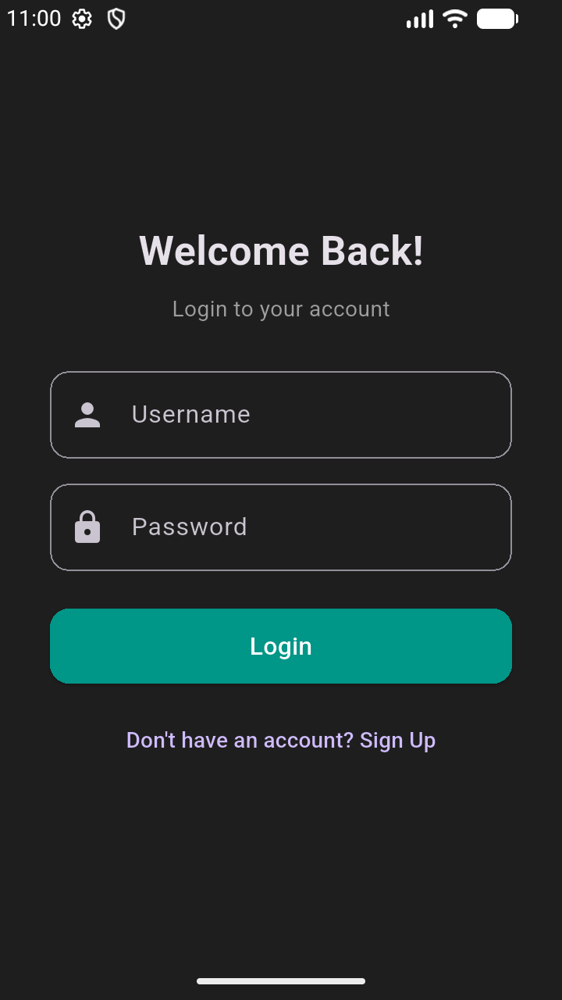 | 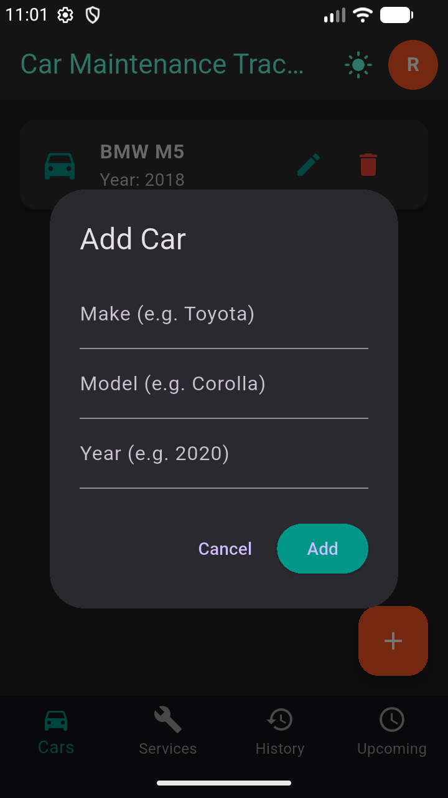 | 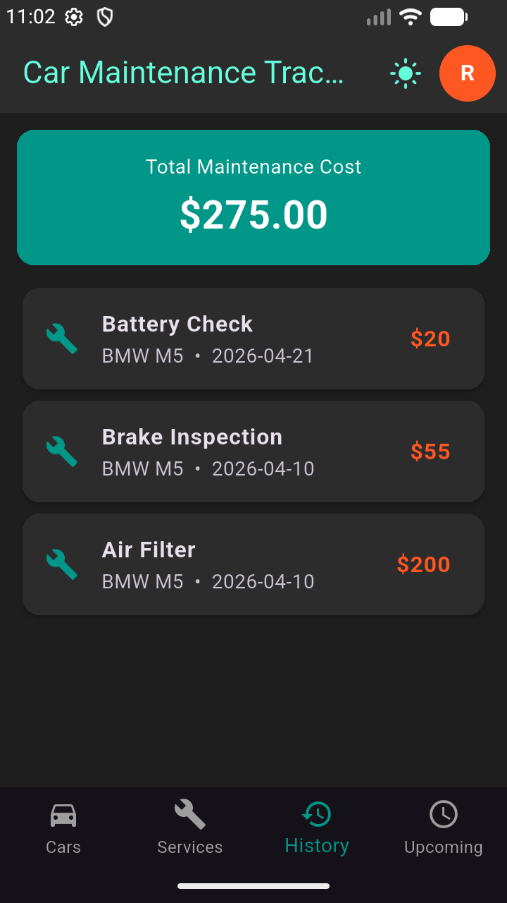 |
| 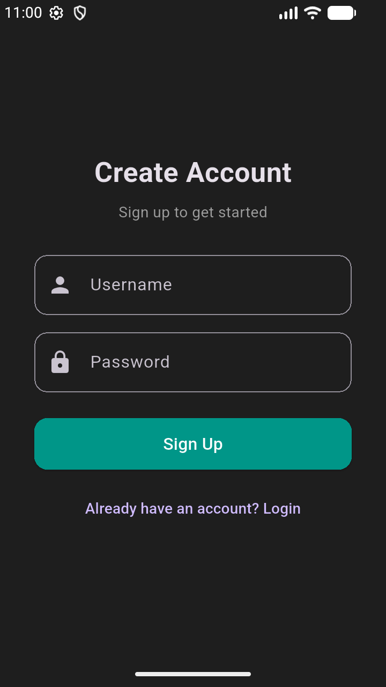 | 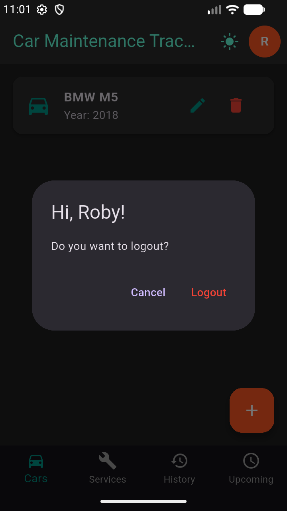 | 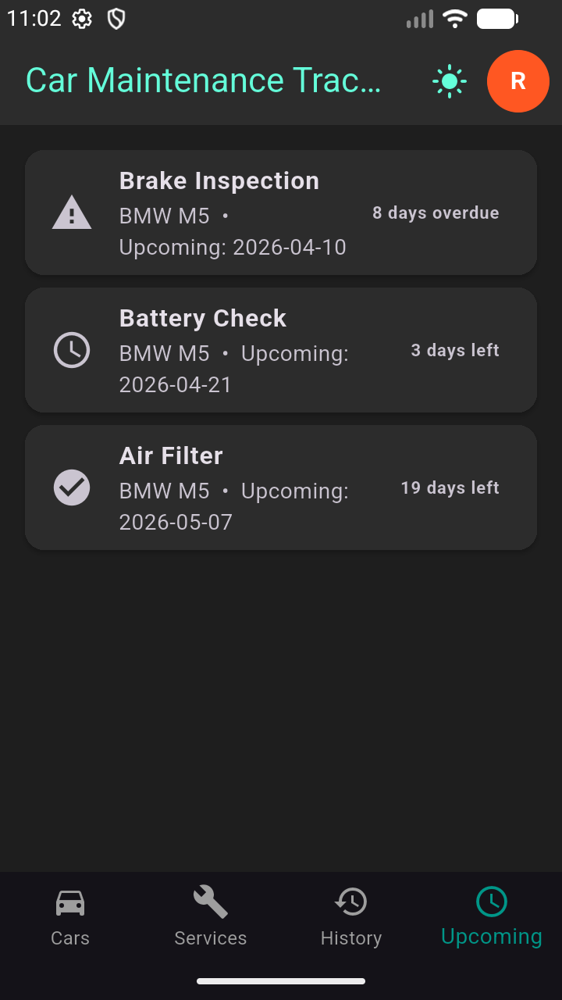 |
| 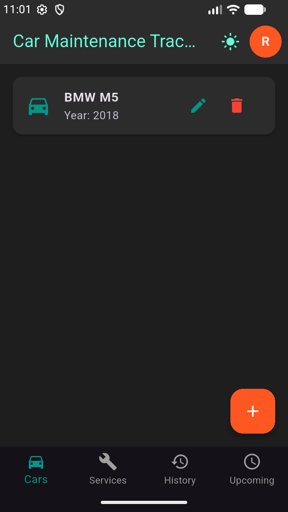 | 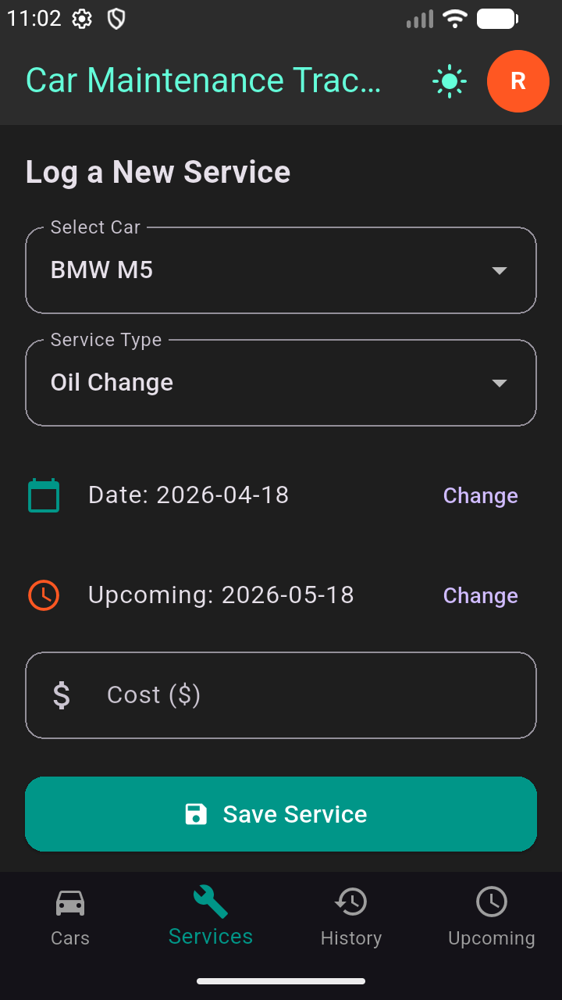 | 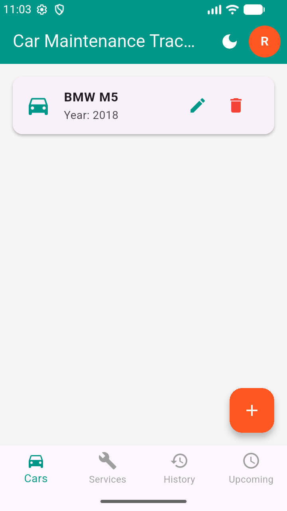 |
| | | 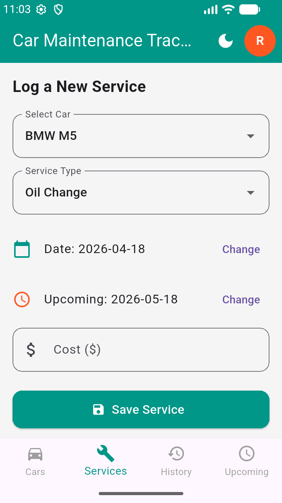 |
| | | 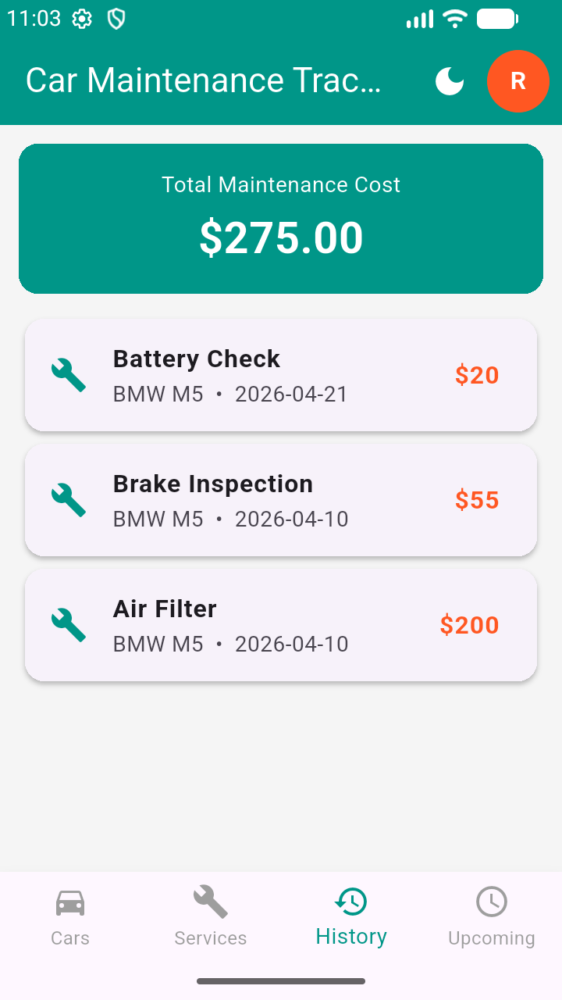 |
| | | 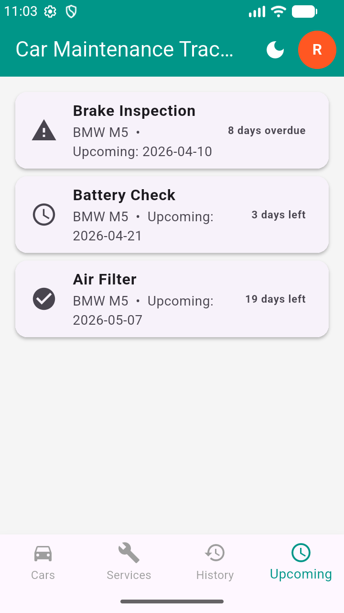 |

## Tech Stack

- **Flutter** – Mobile app framework
- **Dart** – Programming language
- **SharedPreferences** – Local data storage
- **Android Studio** – Development environment

## Project Structure

```
lib/
├── main.dart                    # App entry, theme, auth check
└── screens/
    ├── login_screen.dart        # User login
    ├── signup_screen.dart       # User registration
    ├── home_screen.dart         # Main shell (AppBar + Bottom Nav)
    ├── add_car_screen.dart      # Add/edit/delete cars
    ├── add_service_screen.dart  # Log maintenance services
    ├── history_screen.dart      # Service history + total cost
    └── upcoming_screen.dart     # Upcoming/overdue services
```

## App Workflow

1. User opens the app
2. User signs up or logs in
3. Adds car details
4. Logs maintenance service
5. Data is saved locally
6. User views service history and upcoming services

## Modules

| Module | Description |
|--------|-------------|
| Authentication | User registration, login, logout |
| Car Management | Add, edit, delete car details |
| Service Management | Log and store service records |
| History & Cost | Display past services and total expenses |
| Upcoming Services | Show scheduled services with days remaining |

## How to Run

1. Clone the repository
2. Open in Android Studio
3. Run `flutter pub get` to install dependencies
4. Run `flutter run` or press the ▶ Run button

## Notes

- All data is stored locally using SharedPreferences
- Data resets each time the app is restarted
